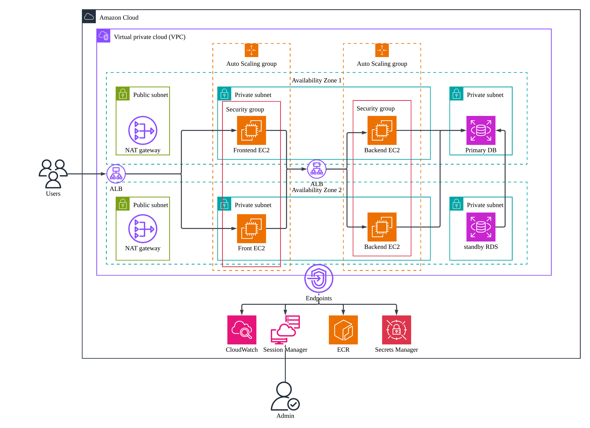

# terraform-3tier-application-ha

Terraform project for a highly available three-tier application on AWS.

This repository is intended to be used as a standalone Terraform root module. It provisions the network, load balancers, EC2 Auto Scaling Groups, RDS database, IAM roles, VPC endpoints, Secrets Manager entries, and CloudWatch resources needed to run a containerized frontend and backend application in private subnets.

## Architecture



Traffic enters through the internet-facing Application Load Balancer on port `80`, reaches the frontend Auto Scaling Group on container port `3000`, then flows through an internal Application Load Balancer to the backend Auto Scaling Group on container port `8080`. The backend connects to a private Multi-AZ RDS PostgreSQL database.

EC2 instances are not exposed for SSH. Use AWS Systems Manager Session Manager for administration.

## What This Creates

- VPC across two Availability Zones
- Public subnets for the external ALB and NAT gateways
- Private app subnets for frontend and backend EC2 instances
- Private database subnets for RDS
- Internet-facing ALB for user traffic
- Internal ALB for frontend-to-backend traffic
- Frontend Auto Scaling Group running the frontend Docker image
- Backend Auto Scaling Group running the backend Docker image
- RDS PostgreSQL with generated password
- AWS Secrets Manager secret for database credentials
- IAM instance profiles for EC2, ECR pulls, SSM, CloudWatch Agent, and Secrets Manager
- VPC endpoints for SSM, SSM Messages, EC2 Messages, ECR, CloudWatch Logs, CloudWatch Metrics, Secrets Manager, and S3
- CloudWatch log groups and basic alarms

## Repository Layout

```text
terraform-3tier-application-ha/
  README.md
  docs/
    architecture.png
  main.tf
  provider.tf
  variables.tf
  terraform.tfvars.example
  modules/
    alb/
    backend-asg/
    cloudwatch/
    endpoint/
    frontend-asg/
    iam/
    network/
    rds/
    secrets/
    sg/
```

The root module is the repository root. Local modules are referenced with `./modules/...`, which works both locally and in HCP Terraform because the module directory is inside the root module.

## Prerequisites

- Terraform `~> 1.15.0`
- AWS CLI v2
- Docker
- AWS Session Manager plugin
- AWS credentials with permissions to create VPC, EC2, ALB, ASG, IAM, RDS, ECR access policies, Secrets Manager, SSM Parameter Store, VPC endpoints, and CloudWatch resources
- Existing frontend and backend ECR repositories

This project expects two ECR images:

```text
<account-id>.dkr.ecr.<region>.amazonaws.com/<frontend-repository-name>:<tag>
<account-id>.dkr.ecr.<region>.amazonaws.com/<backend-repository-name>:<tag>
```

## Configure Variables

Create your local variable file from the example:

```powershell
Copy-Item terraform.tfvars.example terraform.tfvars
```

Then edit `terraform.tfvars`:

```hcl
project_name = "three-tier"
environment  = "dev"
region       = "us-east-1"

vpc_cidr  = "10.10.0.0/16"
subnet_az = ["us-east-1a", "us-east-1b"]

db_engine_version = "15.17"

backend_ecr_repository_arn  = "arn:aws:ecr:us-east-1:<account-id>:repository/<backend-repository-name>"
frontend_ecr_repository_arn = "arn:aws:ecr:us-east-1:<account-id>:repository/<frontend-repository-name>"

backend_docker_image  = "<account-id>.dkr.ecr.us-east-1.amazonaws.com/<backend-repository-name>:<tag>"
frontend_docker_image = "<account-id>.dkr.ecr.us-east-1.amazonaws.com/<frontend-repository-name>:<tag>"
```

`terraform.tfvars` is ignored by Git. Commit only `terraform.tfvars.example`.

### Deployment Parameter Checklist

Review these values before running `terraform plan` or `terraform apply`:

| Parameter | Purpose | Notes |
| --- | --- | --- |
| `project_name` | Prefix for AWS resource names | Keep it short and start with a letter. ALB and target group names have length limits. |
| `environment` | Environment label | Example: `dev`, `stage`, or `prod`. |
| `region` | AWS region | The provider is currently set to `us-east-1`; keep this aligned with your ECR, VPC, and RDS settings. |
| `vpc_cidr` | VPC CIDR block | Example: `10.10.0.0/16`. Avoid overlap with existing networks. |
| `subnet_az` | Availability Zones | At least two AZs are recommended for high availability. |
| `backend_ecr_repository_arn` | Backend ECR repository ARN | Use your own backend ECR repository name. This must match the repository part of `backend_docker_image`. |
| `frontend_ecr_repository_arn` | Frontend ECR repository ARN | Use your own frontend ECR repository name. This must match the repository part of `frontend_docker_image`. |
| `backend_docker_image` | Backend container image URL | Must include registry, repository, and tag. Example: `<account-id>.dkr.ecr.us-east-1.amazonaws.com/my-backend:latest`. |
| `frontend_docker_image` | Frontend container image URL | Must include registry, repository, and tag. Example: `<account-id>.dkr.ecr.us-east-1.amazonaws.com/my-frontend:latest`. |
| `external_tg_port` | Frontend target group port | Must match the port exposed by the frontend container. Current default is `3000`. |
| `internal_tg_port` | Backend target group port | Must match the port exposed by the backend container. Current default is `8080`. |
| `external_health_check_path` | Frontend health check path | Use `/health` only if the frontend returns `200 OK` there. Otherwise use `/`. |
| `internal_health_check_path` | Backend health check path | Use the backend endpoint that returns `200 OK`. |
| `db_engine_version` | RDS PostgreSQL version | Must be available in the selected AWS region. Current example uses `15.17`. |
| `db_instance_class` | RDS instance size | Example: `db.t3.micro` for demos. |
| `db_multi_az` | RDS Multi-AZ setting | `true` is recommended for this HA demo, but costs more than single-AZ. |
| `backend_min_size`, `backend_max_size`, `backend_desired_capacity` | Backend ASG capacity | Keep desired capacity within min and max. |
| `frontend_min_size`, `frontend_max_size`, `frontend_desired_capacity` | Frontend ASG capacity | Keep desired capacity within min and max. |

The container ports in `terraform.tfvars` must match the ports used by the userdata scripts:

```text
Frontend: host port 3000 -> container port 3000
Backend:  host port 8080 -> container port 8080
```

If your application listens on different ports, update both the target group port variables and the corresponding userdata script in `modules/frontend-asg/userdata/` or `modules/backend-asg/userdata/`.

## HCP Terraform or Local Terraform

This project is currently configured to use HCP Terraform remote runs by default. The `cloud` block in `provider.tf` points Terraform to an HCP Terraform organization and workspace:

```hcl
cloud {
  organization = "gangyao-terrafrom-learn"

  workspaces {
    name = "3-tier-with-ha"
  }
}
```

To use your own HCP Terraform account, replace both values:

```hcl
cloud {
  organization = "your-hcp-terraform-organization"

  workspaces {
    name = "your-workspace-name"
  }
}
```

Because this repository is now a standalone Terraform project, the HCP Terraform workspace working directory should be the repository root. Leave the working directory blank unless this project is inside another larger repository.

For HCP Terraform remote runs, local `aws configure` credentials are not automatically used. Add AWS credentials to the HCP Terraform workspace as environment variables:

```text
AWS_ACCESS_KEY_ID
AWS_SECRET_ACCESS_KEY
AWS_DEFAULT_REGION=us-east-1
```

If using temporary credentials, also add:

```text
AWS_SESSION_TOKEN
```

Mark `AWS_SECRET_ACCESS_KEY` and `AWS_SESSION_TOKEN` as sensitive.

To run Terraform locally instead of HCP Terraform, remove or comment out the entire `cloud` block in `provider.tf`:

```hcl
terraform {
  required_version = "~>1.15.0"

  required_providers {
    aws = {
      source  = "hashicorp/aws"
      version = "~>6.0"
    }
  }
}
```

Then configure local AWS credentials:

```powershell
aws configure
aws sts get-caller-identity
```

## Build and Push Docker Images

Login to ECR:

```powershell
aws ecr get-login-password --region us-east-1 `
  | docker login --username AWS --password-stdin <account-id>.dkr.ecr.us-east-1.amazonaws.com
```

Build and push backend:

```powershell
docker build -t <backend-local-image-name>:<tag> ./backend
docker tag <backend-local-image-name>:<tag> <account-id>.dkr.ecr.us-east-1.amazonaws.com/<backend-repository-name>:<tag>
docker push <account-id>.dkr.ecr.us-east-1.amazonaws.com/<backend-repository-name>:<tag>
```

Build and push frontend:

```powershell
docker build -t <frontend-local-image-name>:<tag> ./frontend
docker tag <frontend-local-image-name>:<tag> <account-id>.dkr.ecr.us-east-1.amazonaws.com/<frontend-repository-name>:<tag>
docker push <account-id>.dkr.ecr.us-east-1.amazonaws.com/<frontend-repository-name>:<tag>
```

The local image names can be anything convenient. The pushed ECR image URLs must match `backend_docker_image` and `frontend_docker_image` in `terraform.tfvars`. Adjust the build paths if the application source code lives outside this Terraform repository.

## Cost Estimate and Warning

This architecture is for learning high availability patterns, but it is not a free-tier-only setup. If left running 24/7, it can become expensive. The numbers below are only rough planning estimates; AWS prices, taxes, free-tier credits, and regional rates can change.

The rough estimate below assumes:

- Region: `us-east-1`
- Runtime: `730` hours per month
- Low traffic
- 2 public subnets, 2 app subnets, 2 database subnets
- 2 NAT gateways
- 2 ALBs, one external and one internal
- 2 frontend `t3.micro` instances
- 2 backend `t3.micro` instances
- 1 Multi-AZ RDS PostgreSQL `db.t3.micro`
- 8 interface VPC endpoint services across 2 AZs
- Low CloudWatch log ingestion and low data transfer

| Item | Estimated monthly cost | Why it costs money |
| --- | ---: | --- |
| 2 NAT gateways | About `$65+` before data processing | NAT gateways are charged hourly, plus per-GB data processing. |
| VPC interface endpoints | About `$115+` before data processing | Each interface endpoint is charged per AZ per hour. This stack creates several endpoint services across two AZs. |
| 2 Application Load Balancers | About `$33+` before LCU usage | ALBs are charged hourly, plus LCU usage. |
| 4 EC2 `t3.micro` instances | About `$30+` | Two frontend and two backend instances running all month. |
| EC2 root EBS volumes | About `$6+` | Four 20 GiB gp3 volumes. |
| RDS PostgreSQL Multi-AZ `db.t3.micro` | About `$25-$35+` before extra storage/backup | Multi-AZ runs a standby database instance. |
| RDS storage | About `$3-$6+` | Depends on storage type, size, and Multi-AZ storage behavior. |
| Secrets Manager | About `$1` | Secret storage and API calls are billed. |
| CloudWatch logs, alarms, custom metrics | About `$1-$10+` | Depends on log volume and custom metrics from the CloudWatch Agent. |
| Data transfer | Variable | Public internet egress, NAT processing, and endpoint data processing can add cost. |

A realistic low-traffic monthly total is roughly:

```text
$250 - $350+ per month
```

The largest fixed-cost items are usually:

```text
1. VPC interface endpoints
2. NAT gateways
3. ALBs
4. RDS Multi-AZ
```

For short demos, destroy the stack when you are done:

```powershell
terraform destroy
```

For a cheaper learning version, consider:

- Reducing ASG desired capacity to `1` for frontend and backend
- Using a single NAT gateway
- Removing VPC interface endpoints and using NAT only
- Using single-AZ RDS
- Destroying the stack outside study/demo time

Always verify cost with the AWS Pricing Calculator before keeping the stack running:

```text
https://calculator.aws/
```

Useful AWS pricing references:

- https://aws.amazon.com/vpc/pricing/
- https://aws.amazon.com/privatelink/pricing/
- https://aws.amazon.com/elasticloadbalancing/pricing/
- https://aws.amazon.com/ec2/pricing/on-demand/
- https://aws.amazon.com/rds/postgresql/pricing/

## Deploy

From the repository root:

```powershell
cd C:\Study\terraform-learning\terraform-3tier-application-ha
terraform init
terraform validate
terraform plan
terraform apply
```

If your AWS account has never used EC2 Auto Scaling before, create the service-linked role once:

```powershell
aws iam create-service-linked-role --aws-service-name autoscaling.amazonaws.com
```

If AWS returns `EntityAlreadyExists`, the role is already present.

## Access the Application

Get the external ALB DNS name:

```powershell
aws elbv2 describe-load-balancers `
  --region us-east-1 `
  --names three-tier-dev-ext-alb `
  --query "LoadBalancers[0].DNSName" `
  --output text
```

Open the returned DNS name with HTTP:

```text
http://<external-alb-dns-name>
```

The current ALB listener is HTTP on port `80`. HTTPS on port `443` is not configured.

Quick connectivity test:

```powershell
$alb = "<external-alb-dns-name>"
curl.exe -v "http://$alb/"
Test-NetConnection $alb -Port 80
Test-NetConnection $alb -Port 443
```

Port `80` should be reachable. Port `443` is expected to fail unless you add an HTTPS listener and ACM certificate.

## Session Manager Access

List running EC2 instances:

```powershell
aws ec2 describe-instances `
  --region us-east-1 `
  --filters "Name=instance-state-name,Values=running" `
  --query "Reservations[].Instances[].{ID:InstanceId,Name:Tags[?Key=='Name']|[0].Value,PrivateIP:PrivateIpAddress}" `
  --output table
```

Check SSM status:

```powershell
aws ssm describe-instance-information `
  --region us-east-1 `
  --query "InstanceInformationList[].{ID:InstanceId,Ping:PingStatus,Name:ComputerName}" `
  --output table
```

Start a session:

```powershell
aws ssm start-session --target i-xxxxxxxxxxxxxxxxx --region us-east-1
```

Check the frontend container from a frontend instance:

```bash
sudo docker ps
curl -i http://127.0.0.1:3000/
curl -i http://127.0.0.1:3000/health
sudo docker logs goal-tracker-frontend --tail 100
```

Check the backend container from a backend instance:

```bash
sudo docker ps
curl -i http://127.0.0.1:8080/health
sudo docker logs goal-tracker-backend --tail 100
```

## Health Checks

The external target group forwards to frontend instances on port `3000`:

```hcl
external_tg_port           = 3000
external_health_check_path = "/health"
```

The internal target group forwards to backend instances on port `8080`:

```hcl
internal_tg_port           = 8080
internal_health_check_path = "/health"
```

If the frontend app serves `/` but does not serve `/health`, change:

```hcl
external_health_check_path = "/"
```

Then apply again:

```powershell
terraform apply
```

Check target health:

```powershell
$tgArn = aws elbv2 describe-target-groups `
  --region us-east-1 `
  --names three-tier-dev-ext-tg `
  --query "TargetGroups[0].TargetGroupArn" `
  --output text

aws elbv2 describe-target-health `
  --region us-east-1 `
  --target-group-arn $tgArn `
  --output table
```

## Common Troubleshooting

### HCP Terraform cannot find local modules

The HCP Terraform workspace must run from this repository root. Local module sources should look like:

```hcl
source = "./modules/network"
```

If this project is nested inside another repository, set the HCP Terraform workspace working directory to the path that contains `main.tf` and `modules/`.

### No valid credential sources found

For HCP Terraform remote runs, configure AWS credentials as workspace environment variables. Local `aws configure` credentials are not used by remote runs.

### RDS cannot find PostgreSQL version

Use a PostgreSQL version available in your selected AWS region. This project currently uses:

```hcl
db_engine_version = "15.17"
```

List available PostgreSQL 15 versions:

```powershell
aws rds describe-db-engine-versions `
  --engine postgres `
  --region us-east-1 `
  --query "DBEngineVersions[?starts_with(EngineVersion, '15.')].EngineVersion"
```

### ALB connection refused

Use HTTP:

```text
http://<external-alb-dns-name>
```

Then check:

- External ALB listener exists on port `80`
- ALB security group allows inbound `80`
- Target group has healthy frontend instances
- Frontend security group allows inbound `3000` from the ALB security group
- Frontend container is listening on `3000`

### Target group is unhealthy

Check the health endpoint on the instance:

```bash
curl -i http://127.0.0.1:3000/health
```

If it is not `200 OK`, either add a health endpoint to the app or update the target group health check path.

## Destroy

```powershell
terraform destroy
```

RDS final snapshot is disabled in this demo configuration. Do not use that setting for production unless you understand the data loss risk.

## Notes

- Frontend and backend EC2 instances run in private subnets.
- Browser traffic goes through the external ALB.
- Frontend-to-backend traffic goes through the internal ALB.
- Database credentials are generated by Terraform and stored in AWS Secrets Manager.
- EC2 bootstrap logs are written to `/var/log/user-data.log` and shipped through CloudWatch Agent.
